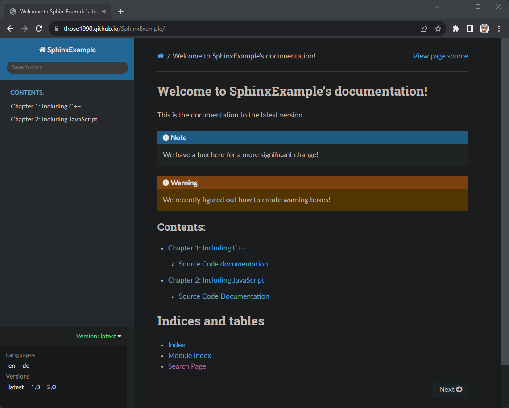

# A Sphinx Example

This is a Sphinx example which creates a documentation with versioning in multiple languages. 

Find my <a href="https://www.codingwiththomas.com/blog/my-sphinx-best-practice-for-a-multiversion-documentation-in-different-languages" target="_blank">blog post here</a> where I go through the entire project form the beginning. 

This includes: 
- Project set up
- Add C++ source code documentation
- Add JavaScript source code documentation
- Add all versions and langauges to the box on the lower left
- Deploy you documentation to GitHub Pages

The final result here looks like this: 

